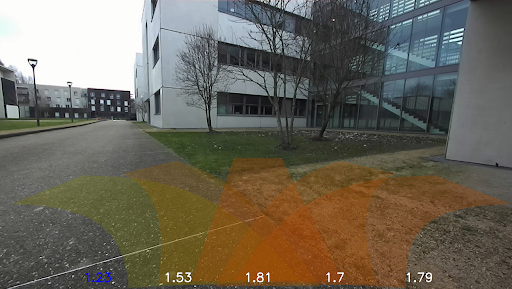

# Extended DWA Local Planner

## About

This repository contains a ROS package that implements a classic [DWA local planner](https://wiki.ros.org/dwa_local_planner) including a terrain traversability analysis. The code was developed as part of a 6-month research internship in the Computer Science and Systems Engineering Laboratory (U2IS) at ENSTA Paris. The aim is to add a traversal cost to each of the trajectories generated by the local planner. The cost in question is predicted by a convolutional neural network (CNN) trained in a self-supervised way on images of terrains that the robot has already traversed, and is constructed from the vibrational data recorded by the robot's inertial measurement unit (IMU). A guide to how the network has been trained and how it can be used for local navigation is currently being prepared.



*Figure: Visualization of live prediction of the traversal cost for 5 candidate local trajectories (a color gradient from green to red is used to represent the trajectories from the most traversable to the least traversable).*


## Quick Start

Once the package has been added to a ROS workspace, and the code compiled with *catkin*, the local planner should be recognized as a plugin. You can check that it is registered using the following command:

```console
$ rospack plugins --attrib=plugin nav_core
```
The plugin should appear under the name *dwa_ext_local_planner*.

The local planner can then be used in the classic way with *move_base*. To do this, simply configure *move_base* to use the *dwa_ext_local_planner/DWAExtPlannerROS* local planner, and load the custom settings for it (the configuration is described in the **config/dwa_ext_planner.yaml** file, part of which can be reconfigured dynamically via **config/DWAExtPlanner.cfg**).


## Implementation details

The structure of the Dynamic Window Approach (DWA) is inspired by the official implementation (see [here](https://github.com/ros-planning/navigation/tree/noetic-devel/dwa_local_planner)). It has been simplified and does not currently take account of obstacles. It favours local trajectories that are close to the global trajectory, that do not cause the robot to oscillate and that cross terrain with a lower vibrational cost. The code consists of the following files:

* **dwa_ext_local_planner[.cpp/.h]**: local planner code (to respect the structure of the official DWA implementation).
* **dwa_ext_local_planner_ros[.cpp/.h]**: code for integrating the local planner into ROS, the planner inherits from the *nav_core::BaseLocalPlanner* class.(to respect the structure of the official DWA implementation).
* **traversability_cost_function[.cpp/.h]**: implementation of the traversal cost function (vibrational cost) which inherits from the *base_local_planner::TrajectoryCostFunction* class.

In addition to these files, the files **depth[.cpp/.h]** implement a class for managing depth images, and compute normal maps from them (it can be useful depending on the input of the CNN).

To see the Doxygen documentation, open the file **doc/html/index.html** in your favourite browser.
